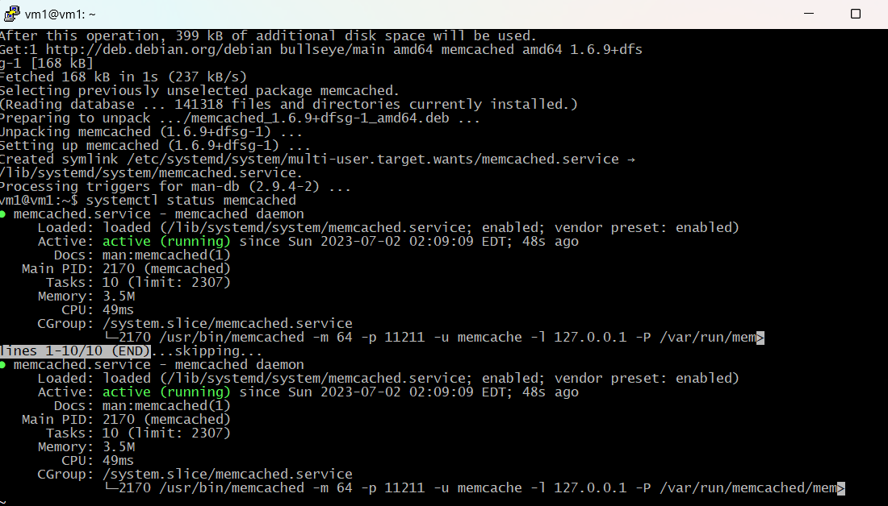
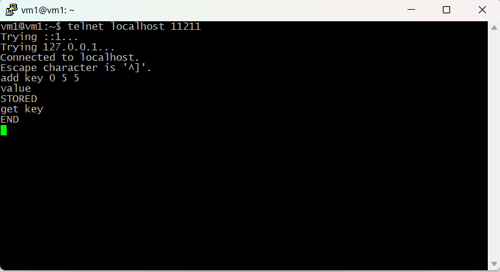
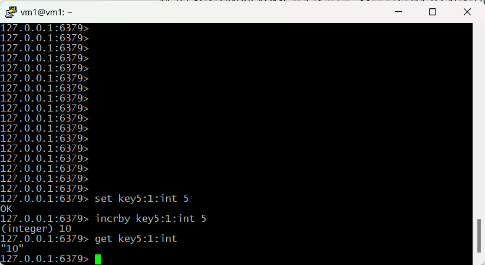

# Домашнее задание к занятию «Кеширование Redis/memcached» - Расулов Магомед

## Задание 1. Кеширование 

Приведите примеры проблем, которые может решить кеширование. 

### Ответ:

1. Повышение производительности - достигается за счет складывания в кэш данных, к которым чаще всего происходит обращение. А также кэширование регулярных составных частей вычислений программ, чтобы не выполнять их каждый раз, а брать из кэша;
2. Увеличение скорости ответа;
3. Экономия ресурсов -  базы данных, например, применяя кэширование тяжелых запросов. Это когда наиболее частые запросы по реляционным БД выполняются заранее и хранятся в кэше, так называемый **прогрев кэша**;
4. Сглаживание бустов трафика. Например, во время черной пятницы онлайн-магазины используют кэш, чтобы переживать резкое увеличение трафика. Путем складывания в кэш (кэширования) данных, которые не часто меняются но чаще всего встречаются в запросах пользователей и лазить за ними в БД каждый раз - дорого.

## Задание 2. Memcached

Установите и запустите memcached.

### Ответ:

## Задание 3. Удаление по TTL в Memcached

Запишите в memcached несколько ключей с любыми именами и значениями, для которых выставлен TTL 5. 

### Ответ:

## Задание 4. Запись данных в Redis

Запишите в Redis несколько ключей с любыми именами и значениями. 

### Ответ:

## Задание 5*. Работа с числами 

Запишите в Redis ключ key5 со значением типа "int" равным числу 5. Увеличьте его на 5, чтобы в итоге в значении лежало число 10.  

### Ответ:

